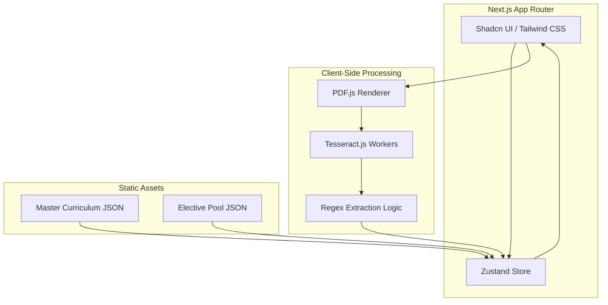
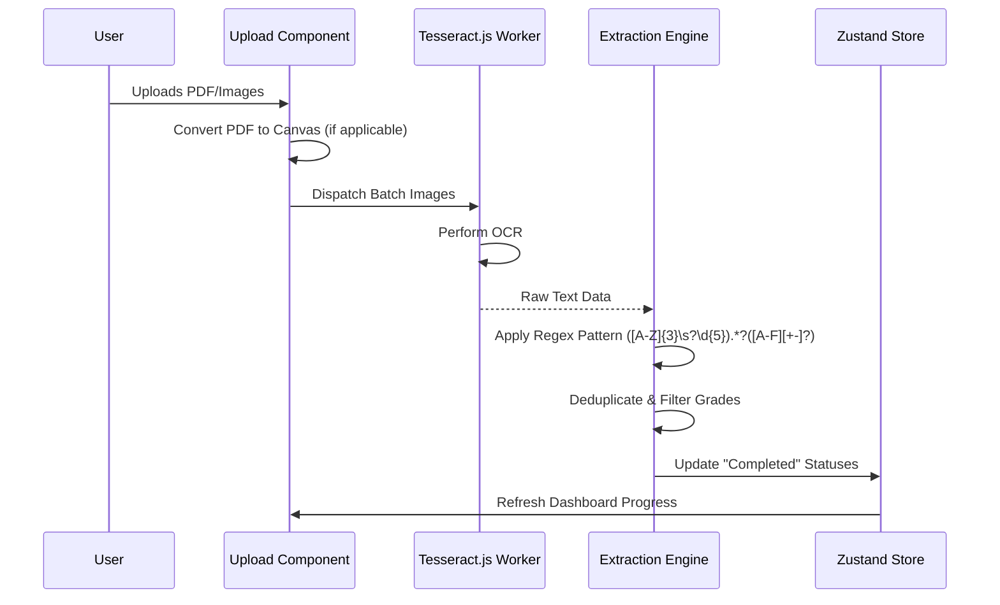

# BIT Academic Progress Tracker 2025/2026 - Implementation Plan

## 1. Project Overview
The **BIT Academic Progress Tracker** is a web-based utility specifically designed for students of the Bachelor of Information Technology with Honours (BIT) program at UTHM (2025/2026 session). It aims to simplify the tracking of academic progress toward the 120-credit graduation requirement.

### Purpose
Students often struggle to manually track completed subjects, electives, and prerequisites. This system automates the process by allowing users to upload transcripts (PDF/Images) or manually manage their checklist, providing a real-time visualization of their path to graduation.

### Core Features
- **Comprehensive Roadmap**: Pre-loaded curriculum for Year 1 to Year 4.
- **Multimodal OCR Extraction**: Processes PDF transcripts or screenshots (PNG/JPG) using Tesseract.js.
- **Smart Grade Analysis**: Automatically flags grades below C- (D+, D, D-, E, F) as "Retake Required."
- **Prerequisite Guard**: Ensures dependencies (e.g., PSM I before PSM II) are met.
- **120-Credit Dashboard**: Visualizes earned credits vs. the graduation target.
- **Privacy-First (No Login)**: All data stays in the browser's local storage; no user accounts or server-side databases required.

---

## 2. System Architecture
The application follows a **Local-First architecture**. To ensure maximum privacy and zero friction, no user authentication is implemented. Data is processed and stored entirely within the user's browser.



### Tech Stack
- **Framework**: Next.js 14+ (App Router)
- **Styling**: Tailwind CSS + Shadcn UI
- **OCR**: Tesseract.js (Multi-threaded workers)
- **PDF Handling**: PDF.js
- **State Management**: Zustand (with `persist` middleware using `localStorage`)
- **Icons**: Lucide React

---

## 3. Process Flow

### OCR & Data Extraction Flow
This flow describes how an uploaded transcript is converted into actionable academic data.



---

## 4. Technical Implementation Phases

### Phase 1: Foundation (Data & State)
- **Master Plan JSON**: Implement the structured curriculum as defined in the project specs.
- **Zustand Store**: Create a store to hold:
    - `completedSubjects`: Map of course codes to grades.
    - `totalCredits`: Computed value based on passed subjects.
    - `alerts`: List of prerequisite violations or retake requirements.
- **LocalStorage Persistence**: Configure Zustand's `persist` middleware to automatically sync state to the browser's local storage, ensuring progress is saved even after page refreshes.
- **Deduplication**: Logic to handle subjects appearing in multiple semester transcripts.

### Phase 2: Processing Engine (OCR & Regex)
- **Parallel Workers**: Initialize multiple Tesseract.js workers for performance.
- **Regex Logic**: Fine-tune the pattern to capture course codes (e.g., `BIT 20803`) and grades (e.g., `A-`).
- **PDF Rendering**: Use PDF.js to convert each page of a transcript into a high-resolution canvas for OCR.

### Phase 3: UI & Validation
- **Checklist View**: A responsive grid of cards grouped by semester.
- **Dashboard**: A "Progress Ring" or "Progress Bar" showing 0/120 credits.
- **Validation Layer**:
    - Check if `BIT 34002` (PSM I) is passed before allowing `BIT 34204` (PSM II).
    - Exclude credits from "Retake Required" subjects.
- **Responsive Design**: Ensure mobile usability for quick checks.

---

## 5. Data Structures

### Master Curriculum (Partial Example)
```json
{
  "program_name": "Bachelor of Information Technology with Honours (BIT)",
  "total_credits_required": 120,
  "curriculum": [
    {
      "year": 1,
      "semesters": [
        {
          "semester": 1,
          "subjects": [
            { "code": "BIT 10103", "name": "Kejuruteraan Perisian", "credits": 3 }
          ]
        }
      ]
    }
  ]
}
```

### Elective Pool
A flat list of potential subjects that can satisfy `BIT ****3` slots.

---

- **Exporting**: Generate a PDF summary of "Remaining Subjects" or export data as a JSON file for manual backup.
- **CGPA Estimator**: Calculate projected CGPA based on extracted grades.
- **Import/Export**: Allow users to download their progress as a `.json` file and upload it on another device to "sync" without a backend.
